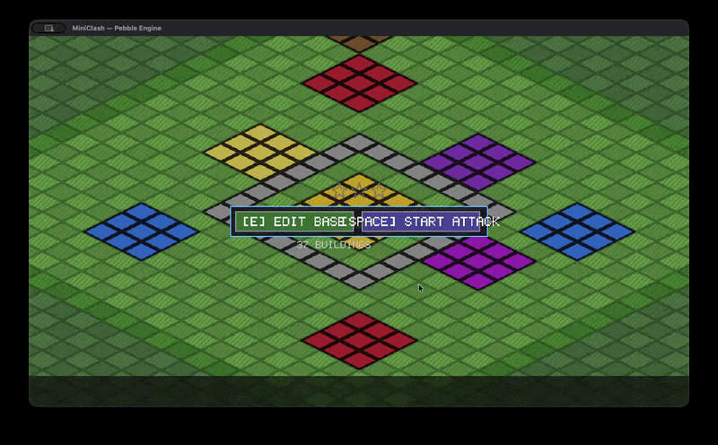

# MiniClash

A Clash of Clans-inspired tower defense game built on a custom C++ engine from scratch.



---

## Why This Project

Supercell runs lean teams that own their technology end-to-end. The Clash of Clans client ships on a proprietary engine purpose-built for the game's needs -- not on Unity, not on Unreal. This project demonstrates the same philosophy: every system here, from the renderer to the memory allocators to the fixed-point simulation, was written from scratch in C++ to solve the specific problems a Clash-style game demands.

MiniClash is a portfolio piece targeting a Senior Game Programmer role on the Clash of Clans team. It is intentionally scoped to be small but deep, prioritizing engine architecture, deterministic simulation, and clean systems design over content volume.

## Play in Browser

*Link TBD* -- MiniClash compiles to WebAssembly via Emscripten with an OpenGL ES 3.0 / WebGL 2.0 renderer.

## Architecture

```
+-------------------------------------------------------------+
|                       MiniClash Game                         |
|  Base Editor / Attack Sim / Defense AI / Replay / Army Comp  |
+-------------------------------------------------------------+
|                      Pebble Engine                           |
|  +-------------+  +-----------+  +----------+  +-----------+|
|  |  Rendering  |  | Flow Field|  |   Math   |  |  Memory   ||
|  | Metal / GL  |  | BFS+Grad  |  | FP 16.16 |  | Pool/Ring ||
|  | Sprite Batch|  | LRU Cache |  | Vec/Mat  |  | Linear    ||
|  +-------------+  +-----------+  +----------+  +-----------+|
|  +-------------+  +-----------+  +----------+  +-----------+|
|  |  Platform   |  |    UI     |  |  Input   |  |   Audio   ||
|  | macOS/Metal |  | Immediate |  | Mouse /  |  | Procedural||
|  | Web/Emscr.  |  | 5x7 Font |  | Keyboard |  | miniaudio ||
|  +-------------+  +-----------+  +----------+  +-----------+|
|  +-------------+                                             |
|  |  Particles  |                                             |
|  | Debris/Spark|                                             |
|  | 512 max     |                                             |
|  +-------------+                                             |
+-------------------------------------------------------------+
|           macOS (Cocoa/Metal) / Web (Emscripten/WebGL)       |
+-------------------------------------------------------------+
```

## Screenshots

*Screenshots coming soon.*

## Engine Features

- **Custom C++ engine ("Pebble Engine")** built from scratch -- no third-party game frameworks.
- **Metal renderer** with sprite batching and ring-buffer GPU vertex uploads (multiple batches per frame without overwrite).
- **OpenGL / WebGL 2.0 renderer** for cross-platform and browser builds via Emscripten.
- **Isometric 2:1 camera** with pan, zoom, and world-to-screen transforms.
- **16.16 fixed-point math library** for deterministic simulation -- no IEEE 754 floats in game logic.
- **Custom memory management:** LinearAllocator (per-frame scratch), PoolAllocator (compact active index iteration, O(active) not O(capacity)), RingBuffer (streaming GPU data).
- **Flow field pathfinding:** BFS + gradient descent with LRU cache; O(1) per-troop movement via cached fields.
- **Particle system:** debris, sparks, explosions (512 particles max).
- **Immediate-mode UI** with 5x7 bitmap font text rendering.
- **Procedural audio:** 12 sound effects generated at runtime via miniaudio.
- **Input system:** keyboard + mouse with macOS key mapping.
- **Data-driven balance:** game tuning loaded from JSON config files.

## Game Features

- **Base editor:** place and remove 8 building types with zone-restricted placement and Town Hall uniqueness enforcement.
- **Attack simulation:** deploy 4 troop types into battle with a 3-minute timer and star-based victory conditions.
- **Defense AI:** cannons (single target), archer towers (long range), mortars (splash damage + minimum range).
- **Deterministic replay:** record player inputs, play back with hash verification at 1x/2x/4x/8x speed.
- **Zone system:** base zone (24x24) for building placement, deploy zone surrounding the base for troop deployment.
- **Army composition:** housing space limit (30) with per-troop inventory management.
- **Building damage states** and health bars rendered on both buildings and troops.
- **Profiling overlay (F1):** FPS, frame time, sprite count, draw calls, memory usage, troop/building count.

## Technical Highlights

**Deterministic Simulation**
- 20 Hz fixed-timestep simulation decoupled from 60 FPS interpolated rendering.
- All gameplay math uses 16.16 fixed-point arithmetic -- no floats in the simulation layer.
- Replay system records only player inputs and verifies bit-identical playback via hash verification.

**Rendering**
- Metal-backed and OpenGL-backed 2D isometric sprite renderer.
- Sprite batching to minimize draw calls across hundreds of on-screen units.
- Ring-buffer GPU vertex uploads: multiple batches per frame without overwrite.

**Pathfinding and AI**
- Flow field pathfinding for efficient mass-unit movement (O(1) per-troop lookup via cached fields).
- Four troop types with distinct behavioral AI: Barbarian (melee rusher), Archer (ranged, targets nearest), Giant (tank, targets defenses), Wall Breaker (suicide unit, targets walls).
- Defense AI for cannons, archer towers, and mortars with splash damage radius.

**Memory and Performance**
- Custom allocators: LinearAllocator for per-frame scratch memory, PoolAllocator for fixed-size game objects with compact active index iteration, RingBuffer for streaming GPU data.
- Building O(1) lookup by ID via direct pointer table.
- Squared distance optimization for O(N^2) troop separation checks.

**UI**
- Immediate-mode UI system for HUD, troop selection, base editor, and debug overlays.
- 5x7 bitmap font text rendering -- no font library dependencies.

**Testing**
- 45 unit tests covering fixed-point math, memory allocators, simulation determinism, victory conditions, and core engine systems.

## Controls

| Key | Action |
|-----|--------|
| E | Edit base (ready screen) |
| SPACE | Start attack / confirm |
| 1-4 | Select troop type (attack) |
| 1-8 | Select building type (editor) |
| W / A / S / D | Pan camera |
| Scroll wheel | Zoom |
| Left-click | Deploy troop / place building |
| Right-click | Remove building (editor) / pan camera |
| P | Pause |
| W | Watch replay (result screen) |
| R | Restart |
| C | Clear all buildings (editor) |
| F1 | Toggle profiler overlay |
| ESC | Quit / cancel |

## Build

**Requirements**
- macOS 12+ (desktop) or Emscripten 3.x (web)
- Xcode Command Line Tools
- CMake 3.20+
- C++17 compiler

**Desktop (macOS)**

```bash
cmake -S . -B build -DCMAKE_BUILD_TYPE=Release
cmake --build build
./build/game/miniclash
```

**Web (WASM)**

```bash
./build_web.sh
# Open build_web/game/miniclash.html in browser
```

**Run Tests (45 unit tests, GoogleTest)**

```bash
cd build && ctest
```

## Project Structure

```
engine/          Pebble Engine
  core/          Memory, math, input, fixed-point
  gfx/           Metal + OpenGL renderers, sprite batch, camera
  framework/     Flow field, particles, UI, tile map
  audio/         Procedural sound effects (miniaudio)
  platform/      macOS (Cocoa/Metal), Web (Emscripten)
game/            MiniClash
  simulation     Deterministic game logic
  building/troop Data and balance
  replay         Record + playback
tests/           45 unit tests (GoogleTest)
data/            Balance JSON, maps
```

## Author

Jo

## License

MIT
